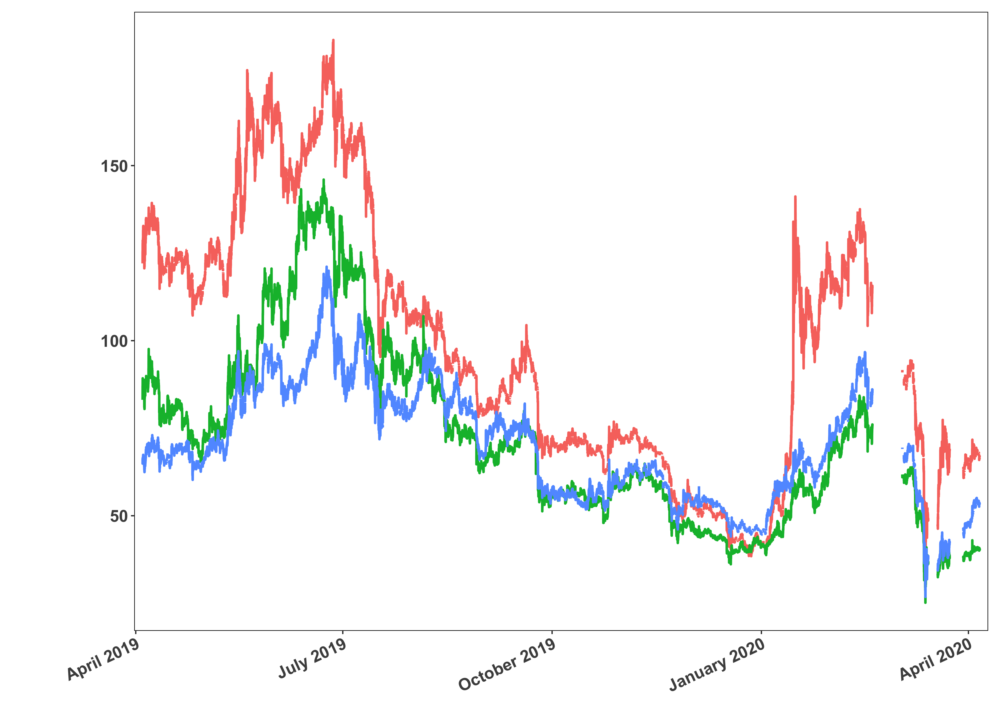

[](http://quantlet.de/)

## [](http://quantlet.de/) **plot_crypto_ts** [](http://quantlet.de/)

```yaml

Name of QuantLet : plot_crypto_ts

Published in : ''

Description : 'Plots time series from cryptocurrency database'

Keywords : high frequency, time series, cryptocurrencies, crypto, tick data

See also : ''

Author : Danial Florian Saef

Submitted : May 13 2020 by Danial Saef
```

